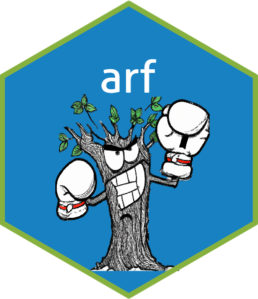

# arfpy: Adversarial random forests <a href='https://bips-hb.github.io/arfpy/'></a>


## Introduction
This is a python implementation of adversarial random forests (ARFs) for density estimation and generative modelling. Adversarial random forests (ARFs) recursively partition data into fully factorized leaves, where features are jointly independent. The procedure is iterative, with alternating rounds of generation and discrimination. Data become increasingly realistic at each round, until original and synthetic samples can no longer be reliably distinguished. This is useful for several unsupervised learning tasks, such as density estimation and data synthesis. Methods for both are implemented in this package. ARFs naturally handle unstructured data with mixed continuous and categorical covariates. They inherit many of the benefits of RFs, including speed, flexibility, and solid performance with default parameters. 

**Documentation** of our code and further examples are provided on this [website](https://bips-hb.github.io/arfpy/). 

## Installation
The `arfpy` package is available on [PyPI](https://pypi.org/project/arfpy/):
```bash
$ pip install arfpy
```
To install the development version from GitHub, run:
```bash
git clone https://github.com/bips-hb/arfpy
python setup.py install
```
We recommend to use `python>=3.8` with the dependencies specified in [requirements.txt](https://github.com/bips-hb/arfpy/blob/master/requirements.txt). 

## Usage
To illustrate the usage of the software, we can use the iris dataset and train an ARF, estimate distribution parameters and generate new data:

```python

from sklearn.datasets import load_iris
from arfpy import arf
import pandas as pd

# Load data
iris = load_iris() 
df = pd.DataFrame(iris['data'], columns=iris['feature_names'])

# Train the ARF
my_arf = arf.arf(x = df)

# Get density estimates
my_arf.forde()

# Generate data
my_arf.forge(n = 10)

```
## Example
Let's generate some data with `arfpy`! We here use twomoons data to showcase data synthesis. You can find the twomoons example as a [tutorial here](https://bips-hb.github.io/arfpy/examples/twomoons.html). For your convenience, we provide this and other examples as jupyter notebooks in the [tutorial folder](https://github.com/bips-hb/arfpy/tree/master/docs/tutorials).


## Contributing
If you'd like to contribute, please have a look at our [contributing guidelines](https://github.com/bips-hb/arfpy/blob/master/CONTRIBUTING.md).

## Tests
We have a GitHub actions workflow running for automated testing of our software. If you'd like to run these tests manually, you can do this by executing the files in the [tests](https://github.com/bips-hb/arfpy/tree/master/tests) folder. The file `test.py` provides the tests and if sourced, runs the tests consecutively on several datasets. 

```bash
cd tests
python test.py
```

If you'd like to run the tests on only a single dataset, you can do this by sourcing the respective test file, e.g., run `test_iris.py` for performing the tests on the iris data set. This implies that if you'd like to run the tests on your own, customized dataset, you can do this by writing your own `test_mydataset.py` file that imports the `TestClass`from `test` and performs the necessary preprocessing steps to your dataset (feel free to use one of our dataset specfic test scripts like `test_diabetes.py` as a template).

## Other distributions
An R implementation of ARF is available on [CRAN](https://cran.r-project.org/web/packages/arf/index.html). For the development version, see [here](https://github.com/bips-hb/arf/).

## Funding 
This work was supported by the German Research Foundation (DFG), Emmy Noether Grant 437611051.

## References
* Watson, D. S., Blesch, K., Kapar, J. & Wright, M. N. (2023). Adversarial random forests for density estimation and generative modeling. In *Proceedings of the 26th International Conference on Artificial Intelligence and Statistics*, PMLR 206:5357-5375. Link [here](https://proceedings.mlr.press/v206/watson23a.html).
